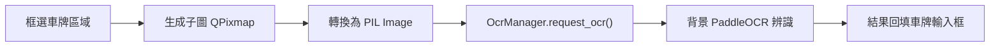
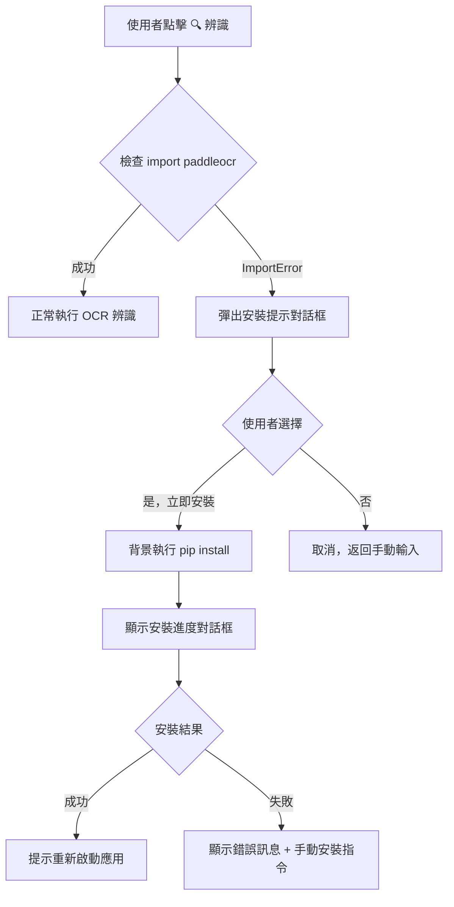

# PhotoMerger 合併計劃書

## 📋 概述

將 **PhotoMerger_P52"/home/banouob/github/PhotoMerger_P52"**（警52雙圖合併）和 **PhotoMerger_4Grid"/home/banouob/github/PhotoMerger_4Grid"**（四格批次合成）合併為統一應用程式 **PhotoMerger**，以模式切換方式支援兩種工作流程，並將共同邏輯提取到共用層。

> [!CAUTION]
> **不可修改原始專案**：合併過程中**嚴禁直接修改** `PhotoMerger_P52/` 和 `PhotoMerger_4Grid/` 的任何檔案。必須另外建立全新的 `PhotoMerger/` 專案目錄，所有程式碼以**複製 + 調整**方式遷入新專案。原始專案保持完整不變，作為參考和備份。

---

## 🔍 現有專案分析

### PhotoMerger_P52（警52模式）

| 項目 | 內容 |
|------|------|
| **用途** | 警52照片 + 目標照片 → 雙圖並排合併 |
| **輸出** | 8192×3000 JPG |
| **操作** | 輸入民國日期 → 選擇警52照片 → 選擇目標照片 → 框選車牌 → 輸入車牌 → 保存 |
| **核心特性** | 框選放大子圖、潔癖模式（衝突檢測）、歸檔（日期+超速分類） |

### PhotoMerger_4Grid（四格模式）

| 項目 | 內容 |
|------|------|
| **用途** | 3張違規照片 + 資訊卡 → 四格拼圖 |
| **輸出** | 2400×1600 JPG |
| **操作** | 開啟資料夾 → 瀏覽案件 → 排序/編輯照片 → 填寫資訊 → 輸出 |
| **核心特性** | 批次掃描、EXIF排序、拖曳排序、箭頭標註、OCR車牌辨識、撤銷/重做、外部config |

---

## 🔗 共同邏輯分析

經過逐行比對，以下 6 個區域存在高度重複的邏輯，應提取到共用層：

### ① ImageEnhancementWorker（影像增強 Worker）

| | P52 位置 | 4Grid 位置 |
|---|---|---|
| **檔案** | `ui/editor_canvas.py` (L20-134) | `ui/image_enhancement_worker.py` |
| **相似度** | **~95% 相同** | |

兩邊的 Worker 邏輯幾乎完全一致：
- 相同的信號定義：`request_processing(int×7)`、`finished(QImage, int)`
- 相同的 request_id 防串圖機制
- 相同的增強演算法順序：亮度 → 對比度 → 飽和度 → 銳化
- 相同的 PIL → QImage 轉換流程

```diff
 # 兩邊完全相同的核心演算法
 factor = 1.0 + (value / 100.0)
 ImageEnhance.Brightness(img).enhance(factor)
 ImageEnhance.Contrast(img).enhance(factor)
 ImageEnhance.Color(img).enhance(factor)
 ImageEnhance.Sharpness(img).enhance(factor)
```

> **合併方案**: 提取為 `core/image_enhancement.py`，包含 `ImageEnhancementWorker` 和 `ImageEnhancementManager`，兩個模式共用。合併時採用 4Grid 的 `tobytes` + 手動建構 QImage 方案（比 P52 的 `ImageQt` 更穩定）。

---

### ② 影像增強演算法

| | P52 位置 | 4Grid 位置 |
|---|---|---|
| **檔案** | `core/image_processor.py` → `apply_enhancements()` | `core/image_processor.py` → `_apply_enhancements()` |
| **相似度** | **~90% 相同** |

兩邊的 `ImageProcessor` 都有一個靜態/實例方法來套用增強，邏輯完全一致。差異僅在於 P52 版本是 `@staticmethod`，4Grid 版本是實例方法。

> **合併方案**: 提取為 `core/image_enhancement.py` 中的 `apply_enhancements()` 共用函式，兩邊的 `ImageProcessor` 改為呼叫此共用函式。

---

### ③ 檔名驗證器（validators.py）

| | P52 | 4Grid |
|---|---|---|
| **檔案** | `utils/validators.py` (135行) | `utils/validators.py` (134行) |
| **相似度** | **100% 相同（除日期驗證）** |

三個共同函式完全相同：
- `sanitize_filename()` — 清洗非法字元
- `validate_filename()` — 驗證檔名合法性
- `get_safe_filename()` — 安全檔名獲取

日期驗證差異：P52 驗證 7 位民國格式，4Grid 驗證 8 位西元格式。

> **合併方案**: 合併為單一 `utils/validators.py`，日期格式**統一使用民國 7 位格式**（YYYMMDD）。`validate_date_format()` 只驗證 7 位民國格式，AD↔ROC 轉換統一由 `date_utils.py` 處理。

---

### ④ 框選裁切（Subimage/ROI Selection）

| | P52 | 4Grid |
|---|---|---|
| **框選方式** | 左鍵拖曳 → `_create_subimage()` | 左鍵拖曳 → `_on_selection_complete()` |
| **子圖管理** | `ResizablePixmapItem` | `ResizablePixmapItem` + `sub_image` dict |
| **裁切操作** | `QPixmap.copy(rect)` → 縮放 | `QPixmap.copy(rect)` → 縮放 |

兩邊都使用 QGraphicsScene 的框選 → 裁切 → 顯示子圖的流程，核心裁切邏輯相似。

> **合併方案**: 框選邏輯保留在各自的畫布中（因佈局差異較大）。P52 的 `ResizablePixmapItem` 提取為共用元件 `ui/shared/graphics_items.py`；4Grid 的 `edit_items.py`（含 `ArrowItem` + 擴充版 `ResizablePixmapItem`）繼續放在 `ui/grid4/edit_items.py`，繼承或引用共用基類。

---

### ⑤ 民國日期轉換

| | P52 | 4Grid |
|---|---|---|
| **函式** | `utils/date_utils.py` → 完整工具集 | `core/data_manager.py` → `convert_to_roc_datetime()` |
| | | `core/archive_manager.py` → `_parse_roc_date()` |

P52 有完整的日期工具模組，4Grid 的民國轉換散落在多個檔案中。

> **合併方案**: 統一使用 P52 的 `utils/date_utils.py`，替換 4Grid `data_manager.py` 和 `archive_manager.py` 中散落的民國日期邏輯。

---

### ⑥ 檔名清理（Sanitize Filename）

| | P52 | 4Grid |
|---|---|---|
| **位置** | `utils/validators.py` → `sanitize_filename()` | `utils/validators.py` + `core/archive_manager.py` → `_sanitize_filename()` |

4Grid 的 `ArchiveManager` 中有額外的 `_sanitize_filename()` 方法（用 replace 而非 regex），功能與 validators 中的版本重複。

> **合併方案**: 統一使用 `utils/validators.py` 的 `sanitize_filename()`，移除 4Grid `archive_manager.py` 中的重複實作。

---

## 🆕 OCR 整合至警52模式

### 可行性

**完全可行**。P52 模式已有完整的框選裁切功能，只需新增以下整合：

### 整合流程圖



### 需要的修改

| 修改 | 位置 | 內容 |
|------|------|------|
| 新增方法 | `ui/p52/editor_canvas.py` | `get_subimage_pil()` — 將 `current_subimage` 的 QPixmap 轉換為 PIL Image（~5行） |
| 新增按鈕 | `ui/p52/main_window.py` | 在車牌輸入框旁新增「🔍 辨識」按鈕 |
| 接入 OCR | `ui/p52/main_window.py` | 初始化 `OcrManager`，連接信號 → 回填車牌 |

### 新增程式碼示例

```python
# editor_canvas.py 新增方法
def get_subimage_pil(self) -> Optional[Image.Image]:
    """將框選子圖轉換為 PIL Image（供 OCR 使用）"""
    if not self.current_subimage:
        return None
    pixmap = self.current_subimage.pixmap()
    qimage = pixmap.toImage().convertToFormat(QImage.Format.Format_RGB888)
    # QImage → PIL Image
    width, height = qimage.width(), qimage.height()
    ptr = qimage.bits()
    ptr.setsize(height * width * 3)
    return Image.frombytes("RGB", (width, height), bytes(ptr))
```

> [!NOTE]
> `OcrWorker` / `OcrManager` 放在共用層 `core/ocr_worker.py`，接收 PIL Image 與模式無關，兩邊直接共用。

---

## 📦 OCR 按需安裝設計

PaddleOCR + PaddlePaddle 套件約 **1.5GB**，不適合作為必裝依賴。採用**按需安裝**方案：

### 依賴分離

```
requirements.txt          # 核心依賴（必裝，輕量）
├── PyQt6>=6.6.0
├── Pillow>=11.0.0
├── pytest>=7.0.0
└── pytest-qt>=4.0.0

requirements-ocr.txt      # OCR 可選依賴（按需安裝）
├── paddlepaddle>=3.0.0
└── paddleocr>=3.0.0
```

### 按需安裝流程



### 架構分層

安裝檢查邏輯按職責分離為兩層，遵守 core/ui 分層原則：

```python
# === core/ocr_worker.py ===
# 只負責檢查依賴是否存在（無 UI 邏輯）

def is_ocr_available() -> bool:
    """檢查 OCR 依賴是否已安裝"""
    try:
        import paddleocr  # noqa: F401
        return True
    except ImportError:
        return False
```

```python
# === ui/shared/ocr_install_dialog.py ===
# 負責 UI 對話框和安裝流程（使用 QMessageBox、QProcess）

import sys
import importlib
from PyQt6.QtWidgets import QMessageBox, QProgressDialog, QApplication
from PyQt6.QtCore import QProcess

def prompt_install_ocr(parent_widget) -> bool:
    """
    提示使用者安裝 OCR 套件

    Returns:
        True 如果安裝成功（需重啟生效）
    """
    reply = QMessageBox.question(
        parent_widget,
        "安裝 OCR 套件",
        "OCR 車牌辨識功能需要額外安裝套件（約 1.5GB）。\n\n"
        "是否立即下載安裝？\n"
        "（安裝過程需要網路連線，約需 2-5 分鐘）",
        QMessageBox.StandardButton.Yes | QMessageBox.StandardButton.No
    )

    if reply != QMessageBox.StandardButton.Yes:
        return False

    return _run_pip_install(parent_widget)


def _run_pip_install(parent_widget) -> bool:
    """背景執行 pip install，顯示進度對話框"""
    progress = QProgressDialog(
        "正在安裝 OCR 套件...\n（首次安裝約需 2-5 分鐘）",
        "取消", 0, 0, parent_widget
    )
    progress.setWindowTitle("安裝中")
    progress.show()

    process = QProcess()
    process.start(sys.executable, [
        "-m", "pip", "install",
        "paddlepaddle>=3.0.0", "paddleocr>=3.0.0"
    ])

    # 等待完成（非阻塞，保持 UI 回應）
    while not process.waitForFinished(100):
        QApplication.processEvents()
        if progress.wasCanceled():
            process.kill()
            return False

    progress.close()

    if process.exitCode() == 0:
        # 清除 import 快取，讓新安裝的模組可被發現
        importlib.invalidate_caches()
        QMessageBox.information(
            parent_widget, "安裝完成",
            "OCR 套件安裝成功！\n請重新啟動應用程式以啟用車牌辨識功能。"
        )
        return True
    else:
        error_msg = process.readAllStandardError().data().decode()
        QMessageBox.warning(
            parent_widget, "安裝失敗",
            f"自動安裝失敗，請手動執行：\n\n"
            f"pip install paddlepaddle>=3.0.0 paddleocr>=3.0.0\n\n"
            f"錯誤：{error_msg[:200]}"
        )
        return False
```

### 使用者體驗

1. **首次使用**：點擊「🔍 辨識」→ 提示安裝 → 一鍵安裝 → **重新啟動後**即可辨識
2. **已安裝**：點擊「🔍 辨識」→ 直接辨識（無額外延遲）
3. **離線環境**：安裝失敗 → 顯示手動安裝指令 → 使用者可稍後自行安裝
4. **不需要 OCR 的使用者**：完全不受影響，不會下載任何額外套件

---

## 📄 CLAUDE.md 比對與合併

> [!IMPORTANT]
> 新 CLAUDE.md 以 **`CLAUDE_TEMPLATE.md`（v1.0.0 by Chang Ho Chien）** 為權威基底，再合併兩舊專案的特定規則。模板中的規則具有最高優先權。

### 三方比對：Template vs P52 vs 4Grid

#### 共通規則（三方皆有或 Template 定義）

| 規則 | Template | P52 | 4Grid | 合併決策 |
|------|----------|-----|-------|----------|
| **絕對禁止事項** | ✅ 10 條 | ✅ 9 條 | ✅ 12 條 | **以 Template 為基底**，補入 4Grid 專屬禁止項 |
| **禁止根目錄建檔** | ✅ 明確禁止 | ❌ 僅禁止「Random .py」 | ❌ 僅禁止「Random .py」 | **採用 Template**（更嚴格） |
| **技術債預防** | ✅ 搜尋優先、單一真相 | ✅ 完全相同 | ✅ 完全相同 | 直接沿用 |
| **債務預防工作流** | ✅ 5 步驟 | ✅ 完全相同 | ✅ 完全相同 | 直接沿用 |
| **Pre-Task 合規檢查** | ✅ 4 步驟（含根目錄檢查） | ✅ 4 步驟 | ✅ 4 步驟 | **採用 Template**（含根目錄項） |
| **強制要求** | ✅ 7 條 | ✅ 7 條 | ✅ 9 條（含 STATE、DRAG） | **以 Template 為基底**，補入 4Grid 專屬項 |

#### GitHub 工作流（Template 定義新標準）

| 項目 | Template | P52 | 4Grid | 合併決策 |
|------|----------|-----|-------|----------|
| **推送方式** | ✅ **Auto-push**（post-commit hook） | 手動推送 | 手動推送 | **採用 Template auto-push** |
| **GitHub CLI 設定** | ✅ `gh` 自動建 repo | ❌ 無 | ❌ 無 | **採用 Template** |
| **備份驗證** | ✅ 要求確認推送成功 | ✅ 相同 | ✅ 相同 | 直接沿用 |

#### 模式專用規則（僅存在於單一專案）

| 規則 | 來源 | 合併決策 |
|------|------|----------|
| Scene 座標系統 4096×3000 | P52 | → P52 專用規則區塊 |
| 影像處理規格 8192×3000 輸出 | P52 | → P52 專用規則區塊 |
| 民國日期歸檔規則 | P52 | → P52 專用規則區塊 |
| OCR 車牌辨識注意事項 | 新增 | → P52 + 4Grid 共用規則 |
| 截圖禁止（canvas.grab）→ 必須用 ImageState | 4Grid | → 4Grid 專用規則區塊 |
| EXIF 排序 → EXIF DateTime 優先 | 4Grid | → 4Grid 專用規則區塊 |
| 拖曳同步 → paths 與 states 必須同步交換 | 4Grid | → 4Grid 專用規則區塊 |
| 狀態保存 → 切換案件時保存 ImageState | 4Grid | → 4Grid 專用規則區塊 |
| 正規化座標 0.0-1.0 | 4Grid | → 4Grid 專用規則區塊 |
| 歸檔 Scheme B → Pillow 轉 JPG + 重命名 | 4Grid | → 4Grid 專用規則區塊 |
| 資訊卡排版 → 懸掛縮排 | 4Grid | → 4Grid 專用規則區塊 |
| 外部設定管理 config.json | 4Grid | → 4Grid 專用規則區塊 |
| Dirty State 管理 | 4Grid | → 4Grid 專用規則區塊 |

---

### 新 CLAUDE.md 結構規劃

以 CLAUDE_TEMPLATE.md 為骨架，合併後的 `CLAUDE.md` 採用**四層結構**：

```
1. Template 基底層（來自 CLAUDE_TEMPLATE.md，最高優先權）
   ├── 🚨 CRITICAL RULES（絕對禁止事項 + 強制要求）
   ├── 🔍 PRE-TASK 合規檢查（含根目錄檢查項）
   ├── 🐙 GitHub Auto-Push 設定（post-commit hook）
   ├── 🚨 技術債預防（搜尋優先、單一真相來源）
   └── 🧹 債務預防工作流（5 步驟）

2. 合併專案架構層（新增）
   ├── 📋 專案概述（PhotoMerger 雙模式應用）
   ├── 🏗️ 專案結構圖（共用層 + P52 + 4Grid）
   ├── 📦 Import 路徑規範
   │   ├── 共用層：from core.xxx / from utils.xxx
   │   ├── P52：from core.p52.xxx / from ui.p52.xxx
   │   └── 4Grid：from core.grid4.xxx / from ui.grid4.xxx
   └── 🔧 技術棧（Python 3.12+, PyQt6, Pillow, PaddleOCR 可選）

3. 模式專用規則層
   ├── 📋 警52模式 (P52) 專用規則
   │   ├── Scene 座標系統 4096×3000
   │   ├── 影像處理規格：8192×3000 輸出
   │   ├── 民國日期歸檔（YYYMMDD 7 位格式）
   │   └── OCR 整合：按需安裝 + get_subimage_pil()
   └── 📋 四格模式 (4Grid) 專用規則
       ├── ❌ 截圖禁止 → 必須用 ImageState + ImageProcessor redraw
       ├── 📸 EXIF 排序 → EXIF DateTime 優先，檔名 fallback
       ├── 🖱️ 拖曳同步 → paths 與 states 必須同步交換
       ├── 💾 狀態保存 → 切換案件時保存 ImageState
       ├── 📐 正規化座標 0.0-1.0
       ├── 🗂️ 歸檔 Scheme B → Pillow 轉 JPG + 1.jpg/2.jpg/3.jpg
       ├── 🖋️ 資訊卡排版 → 懸掛縮排實作
       ├── ⚙️ 外部設定管理 config.json
       └── 💾 Dirty State 管理 → 案件切換前儲存

4. 常用指令 + 合規檢查清單
   ├── 🚀 執行方式：python main.py
   ├── 🧪 測試指令：pytest tests/
   └── 🎯 任務前檢查清單
```

> [!IMPORTANT]
> 新 CLAUDE.md 必須在**第一階段（建立骨架）**時同步建立，確保後續所有開發階段都遵循統一規範。CLAUDE_TEMPLATE.md 中的規則（特別是 auto-push、根目錄禁止、pre-task 合規檢查）具有最高優先權。

---

## 🏗️ 合併後專案結構

```
PhotoMerger/
├── main.py                          # 統一入口 + 模式選擇
├── config/
│   └── config.json                  # 外部設定
├── assets/fonts/
│   └── kaiu.ttf                     # 字型
│
├── CLAUDE.md                        # [新增] 合併後的開發規範
│
├── core/                            # 核心邏輯層
│   ├── __init__.py
│   ├── image_enhancement.py         # [共用] 影像增強 Worker + 演算法
│   ├── ocr_worker.py                # [共用] OCR Worker + 依賴檢查
│   ├── p52/                         # 警52模式專用
│   │   ├── __init__.py
│   │   ├── data_manager.py
│   │   ├── image_processor.py       # 呼叫共用增強演算法
│   │   └── archive_manager.py
│   └── grid4/                       # 四格模式專用
│       ├── __init__.py
│       ├── data_manager.py          # 移除散落的民國轉換，改用 date_utils
│       ├── image_processor.py       # 呼叫共用增強演算法
│       ├── archive_manager.py       # 移除 _sanitize_filename，改用 validators
│       ├── config_manager.py        # 4Grid 專用設定管理
│       └── edit_history.py          # 4Grid 專用撤銷/重做
│
├── ui/                              # 界面層
│   ├── __init__.py
│   ├── mode_selector.py             # [新增] 模式選擇介面
│   ├── shared/                      # [新增] 共用 UI 元件
│   │   ├── __init__.py
│   │   ├── graphics_items.py        # [共用] ResizablePixmapItem 基類
│   │   └── ocr_install_dialog.py    # [共用] OCR 安裝提示對話框
│   ├── p52/                         # 警52模式 UI
│   │   ├── __init__.py
│   │   ├── main_window.py           # + OCR 按鈕整合
│   │   └── editor_canvas.py         # + get_subimage_pil()
│   └── grid4/                       # 四格模式 UI
│       ├── __init__.py
│       ├── main_window.py
│       ├── canvas_view.py
│       ├── control_panel.py
│       ├── thumbnail_list.py
│       ├── edit_toolbar.py
│       └── edit_items.py            # ArrowItem + 擴充 ResizablePixmapItem
│
├── utils/                           # 共用工具層
│   ├── __init__.py
│   ├── validators.py                # [合併] 日期驗證統一為 7 位民國格式
│   ├── paths.py                     # [共用] 路徑管理（字型、設定檔路徑）
│   └── date_utils.py                # [共用] 民國日期工具（ROC↔AD 轉換）
│
├── tests/                           # 測試
├── requirements.txt                 # 核心依賴（輕量）
├── requirements-ocr.txt             # OCR 可選依賴（按需安裝）
└── README.md
```

### 結構說明

| 原始檔案 | 合併後位置 | 操作 |
|---------|-----------|------|
| P52 `ui/editor_canvas.py` 內嵌 Worker | `core/image_enhancement.py` | **提取**，原檔改為 import 共用層 |
| 4Grid `ui/image_enhancement_worker.py` | `core/image_enhancement.py` | **合併後刪除** |
| P52 `ui/graphics_items.py` | `ui/shared/graphics_items.py` | **移動**，提取為共用基類 |
| 4Grid `ui/edit_items.py` | `ui/grid4/edit_items.py` | **保留**，繼承共用基類 |
| 4Grid `core/config_manager.py` | `core/grid4/config_manager.py` | **移動**，僅 4Grid 使用 |
| 4Grid `core/edit_history.py` | `core/grid4/edit_history.py` | **移動**，僅 4Grid 使用 |

---

## 📝 合併步驟

### 第一階段：建立骨架 + 共用層

1. 建立 `PhotoMerger/` 專案目錄結構（含所有 `__init__.py`）
2. **提取共用 `core/image_enhancement.py`**
   - 從 4Grid `image_enhancement_worker.py` 為基礎（使用 `tobytes` 方案）
   - 包含 `ImageEnhancementWorker`、`ImageEnhancementManager`、`apply_enhancements()`
3. **合併 `utils/validators.py`**
   - 統一 `sanitize_filename()`、`validate_filename()`、`get_safe_filename()`
   - `validate_date_format()` 統一為 7 位民國格式
4. **遷移共用模組**
   - `utils/date_utils.py` ← P52
   - `utils/paths.py` ← 4Grid
   - `core/ocr_worker.py` ← 4Grid（新增 `is_ocr_available()` 函式）
5. **提取共用 UI 元件**
   - `ui/shared/graphics_items.py` ← P52 `graphics_items.py`（提取 `ResizablePixmapItem` 基類）
   - `ui/shared/ocr_install_dialog.py`（新增 OCR 安裝對話框）
6. 複製資源：`assets/fonts/`、`config/`
7. 建立 `requirements.txt` + `requirements-ocr.txt`
8. **以 `CLAUDE_TEMPLATE.md` 為基底建立新 `CLAUDE.md`**
   - 以 Template 骨架為基底（絕對禁止、Pre-Task 合規檢查、技術債預防）
   - 設定 GitHub auto-push（post-commit hook）
   - 合併 P52 + 4Grid 模式專用規則區塊
   - 更新專案結構圖和 import 路徑規範
   - 更新 GitHub 倉庫 URL

### 第二階段：遷移模式專用模組

| 來源 | 目標 | 調整 |
|------|------|------|
| P52 `core/*.py` | `core/p52/*.py` | import 改為共用層 |
| P52 `ui/editor_canvas.py` | `ui/p52/editor_canvas.py` | 移除內嵌 Worker，改用 `core.image_enhancement` |
| 4Grid `core/data_manager.py` | `core/grid4/data_manager.py` | 民國轉換改用 `utils.date_utils` |
| 4Grid `core/archive_manager.py` | `core/grid4/archive_manager.py` | 移除 `_sanitize_filename()`、`_parse_roc_date()`，改用共用層 |
| 4Grid `core/config_manager.py` | `core/grid4/config_manager.py` | 修改 import 路徑 |
| 4Grid `core/edit_history.py` | `core/grid4/edit_history.py` | 修改 import 路徑 |
| 4Grid `ui/*.py` | `ui/grid4/*.py` | 修改 import 路徑 |

### 第三階段：OCR 整合至 P52 模式

1. 在 `ui/p52/editor_canvas.py` 新增 `get_subimage_pil()` 方法
2. 在 `ui/p52/main_window.py` 新增「🔍 辨識」按鈕
3. 整合 `is_ocr_available()` + `prompt_install_ocr()` + `OcrManager`
4. 4Grid 原有 OCR 流程保持不變（同樣加入按需安裝提示）

### 第四階段：統一入口 + 模式選擇

建立 `main.py` 和 `ui/mode_selector.py`：
- 啟動顯示模式選擇對話框
- 選擇警52模式 → P52 工作流程
- 選擇四格模式 → 4Grid 工作流程

### 第五階段：測試與驗證

1. 合併測試案例至 `tests/`
2. 驗證共用層各函式
3. 驗證 P52 模式 + OCR 功能
4. 驗證 4Grid 模式功能
5. 驗證模式切換

---

## 📊 共用層 vs 專用層總覽

```mermaid
graph TB
    subgraph "共用層 (Shared)"
        IE["core/image_enhancement.py<br/>影像增強 Worker + 演算法"]
        OCR["core/ocr_worker.py<br/>OCR Worker + 依賴檢查"]
        V["utils/validators.py<br/>檔名驗證 + 民國日期驗證"]
        DU["utils/date_utils.py<br/>民國日期 ROC↔AD 轉換"]
        P["utils/paths.py<br/>字型/設定檔路徑"]
        GI["ui/shared/graphics_items.py<br/>ResizablePixmapItem 基類"]
        OID["ui/shared/ocr_install_dialog.py<br/>OCR 安裝對話框"]
    end

    subgraph "P52 專用"
        P52_DM["core/p52/data_manager.py"]
        P52_IP["core/p52/image_processor.py"]
        P52_AM["core/p52/archive_manager.py"]
        P52_MW["ui/p52/main_window.py"]
        P52_EC["ui/p52/editor_canvas.py"]
    end

    subgraph "4Grid 專用"
        G4_DM["core/grid4/data_manager.py"]
        G4_IP["core/grid4/image_processor.py"]
        G4_AM["core/grid4/archive_manager.py"]
        G4_CM["core/grid4/config_manager.py"]
        G4_EH["core/grid4/edit_history.py"]
        G4_MW["ui/grid4/main_window.py"]
        G4_CV["ui/grid4/canvas_view.py"]
        G4_EI["ui/grid4/edit_items.py"]
    end

    P52_IP --> IE
    G4_IP --> IE
    P52_EC --> IE
    P52_MW --> OCR
    P52_MW --> OID
    G4_MW --> OCR
    G4_MW --> OID
    P52_EC --> GI
    G4_EI -.->|繼承| GI
    P52_MW --> V
    G4_MW --> V
    P52_AM --> DU
    G4_AM --> DU
    G4_DM --> DU
    G4_IP --> P
    P52_EC --> P
```



---

## ⚠️ 風險與注意事項

> [!WARNING]
> **Import 路徑調整量大**：所有 `from core.xxx` 和 `from ui.xxx` 需改為 `from core.p52.xxx` 或 `from core.grid4.xxx`。建議使用全專案搜尋替換。

> [!TIP]
> **OCR 按需安裝**：PaddleOCR + PaddlePaddle 約 1.5GB，已設計為按需安裝方案。安裝成功後需**重新啟動應用程式**才能生效（因 Python 模組系統限制）。

> [!NOTE]
> **4Grid `edit_items.py` 與共用 `graphics_items.py` 的關係**：4Grid 的 `ResizablePixmapItem` 可能比 P52 版有額外功能（如箭頭場景整合）。合併時以 P52 版為基類，4Grid 版繼承擴充。如差異過大，則各自保留獨立版本。

---

## 📊 工作量估算

| 階段 | 預估時間 |
|------|---------|
| 骨架 + 共用層提取 | 40 分鐘 |
| 遷移模式專用模組 | 30 分鐘 |
| OCR 整合至 P52 | 20 分鐘 |
| 統一入口 + 模式選擇 | 20 分鐘 |
| 測試驗證 | 30 分鐘 |
| **合計** | **約 2.5 小時** |
